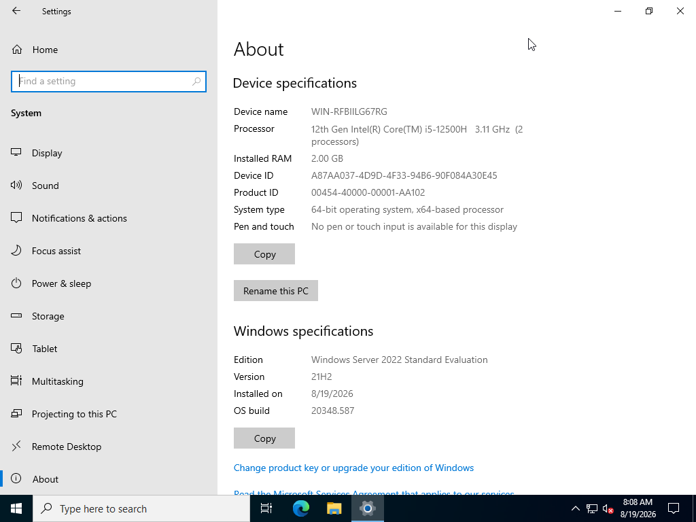
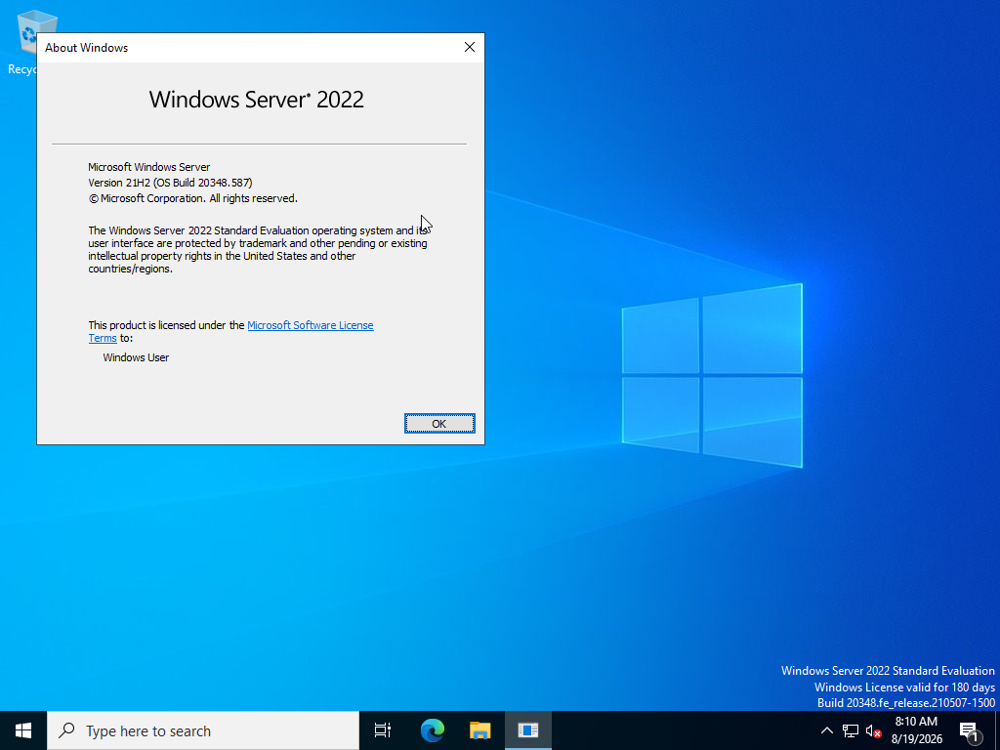
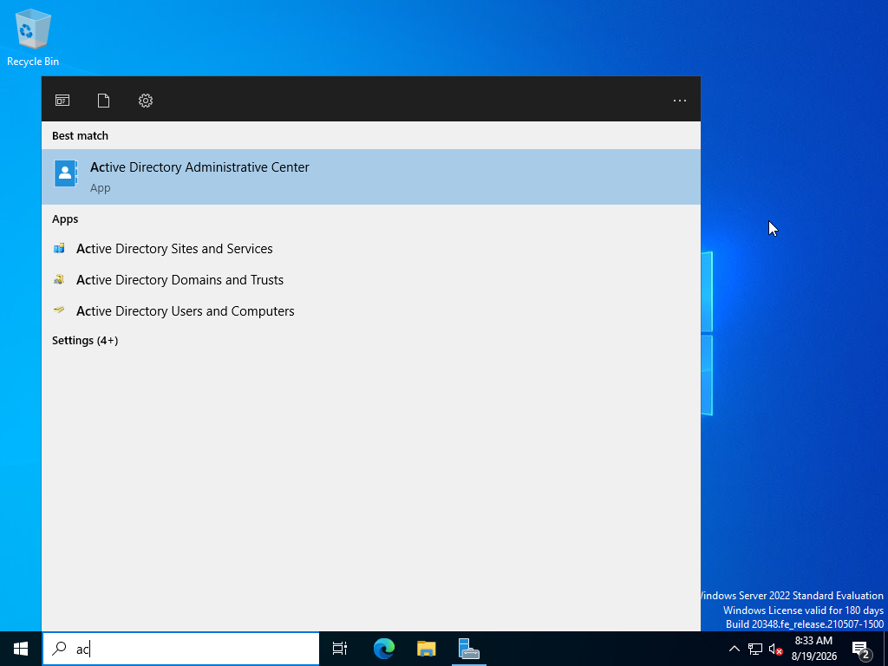
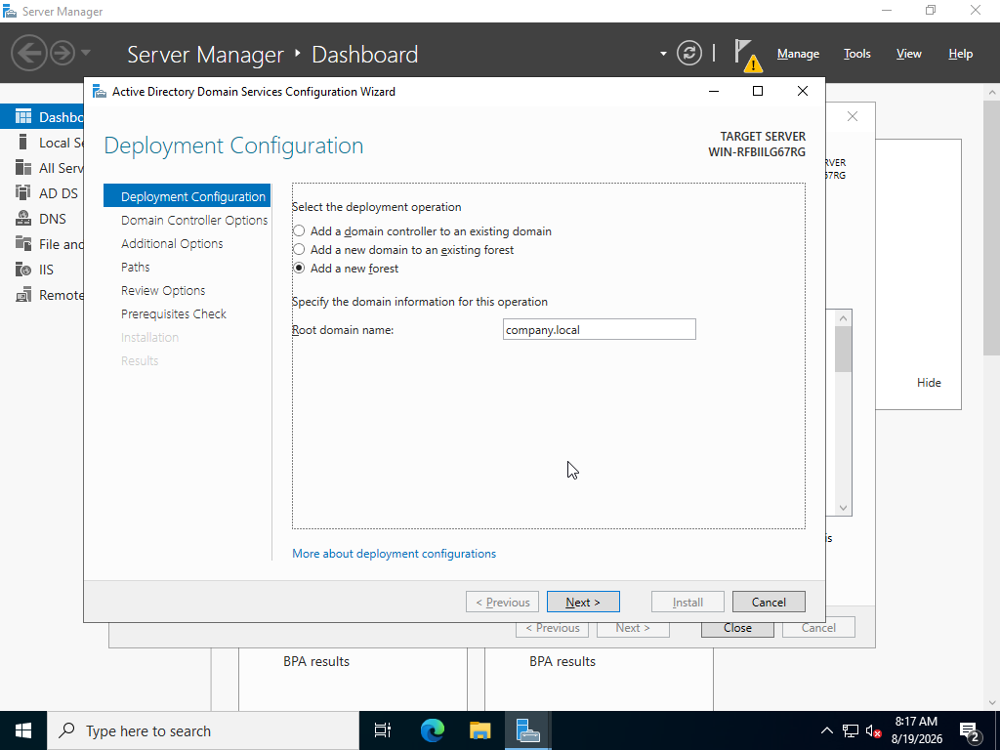

# AD DS Configuration

## Virtual Machine Setup

- **Guest OS:** Windows Server 2022 Standard Evaluation (Desktop Experience)
- **RAM:** 2.0 GB
- **Storage:** 20.0 GB (Thin Provisioned)



---

## Server Roles Installation & Domain Promotion

- **Installed Roles via Server Manager:**
  - Active Directory Domain Services (AD DS)
  - DNS Server
  - Remote Access
- **Domain Promotion:** Promoted the server to a Root Domain Controller for a new forest.
- **Root Domain Name:** `company.local`





---

## Active Directory Structure & Automation

### Organizational Unit (OU) Architecture

Created top-level location OUs and nested child OUs for resource management:

- **Top-Level OUs:** `Mandaluyong`, `Makati`, `Pasig`, `Quiapo`
- **Child OUs (Nested within each branch):**
  - `Computers`
  - `Servers`
  - `Users`

```text
company.local
│
├── Mandaluyong (OU)
│   ├── Computers (OU)
│   ├── Servers (OU)
│   └── Users (OU)
│       ├── Users (Jack Simmons, Manny Smith, Brandy Hernandez)
│       ├── Security Groups (Accounting, HR, IT, Sales)
│       └── Distribution Groups (DL-Accounting, DL-HR, DL-ITAdmins, DL-Sales)
│
├── Makati (OU)
│   ├── Computers (OU)
│   ├── Servers (OU)
│   └── Users (OU)
│
├── Pasig (OU)
│   ├── Computers (OU)
│   ├── Servers (OU)
│   └── Users (OU)
│
└── Quiapo (OU)
    ├── Computers (OU)
    ├── Servers (OU)
    └── Users (OU)
```
