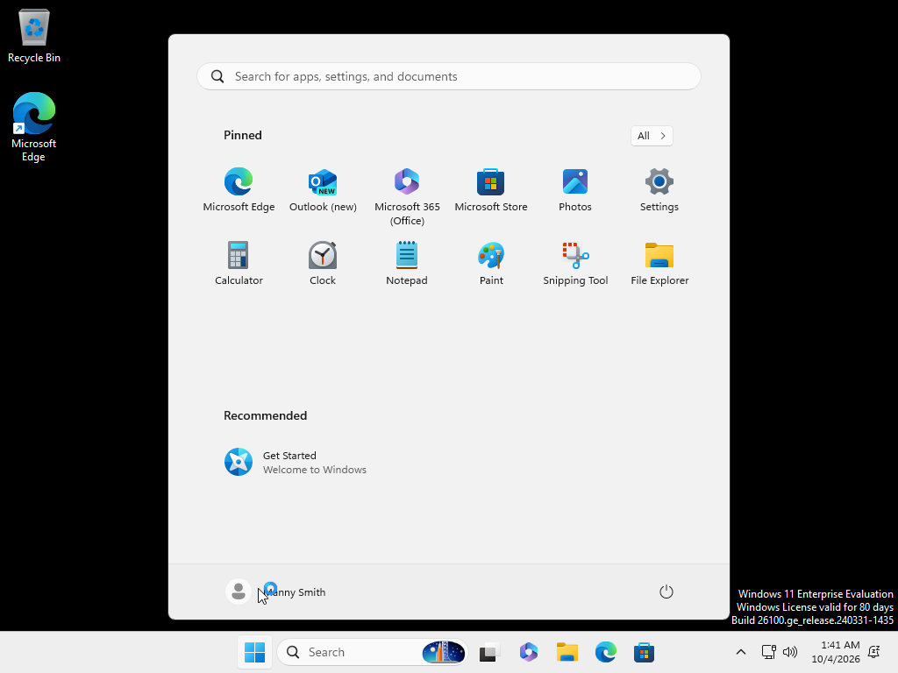
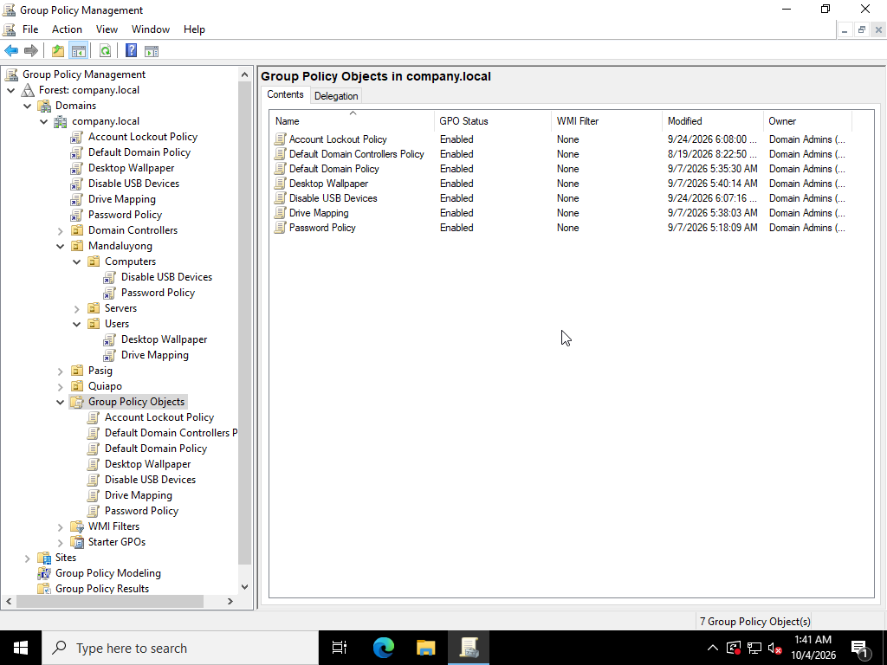
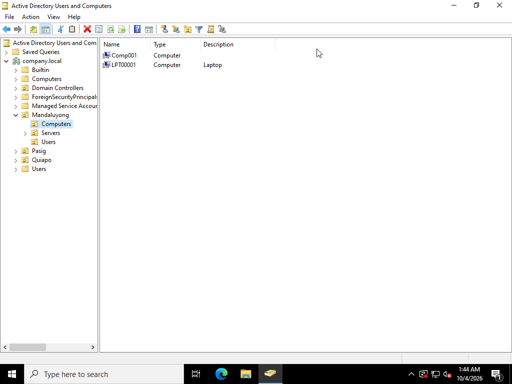

## Applying and Testing GPOs

**Windows Client Provisioning:**

- Created Windows client (Win 11 Enterprise)
  

**Applied GPOs to Mandaluyong OU Users and Computers:**

- Drag and drop GPOs to respective OU and groups
  

**Domain Controller Configuration:**

- Set up Domain Controller on Windows Server as DNS server

**Client Network Configuration:**

- Configured client DNS server (static).

**Active Directory Domain Join:**

- Added client to domain

**Organizational Unit (OU) Management:**

- Moved laptop to Mandaluyong OU
  
