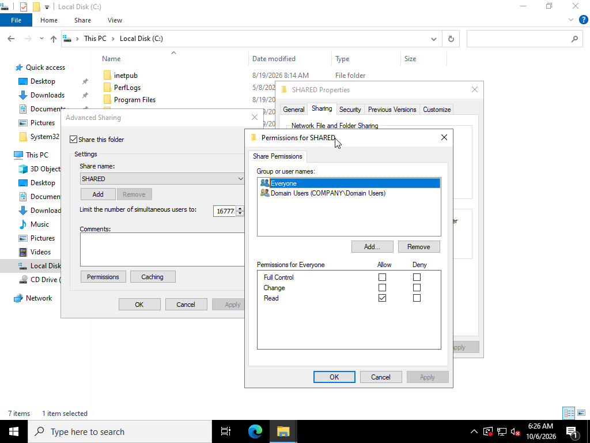
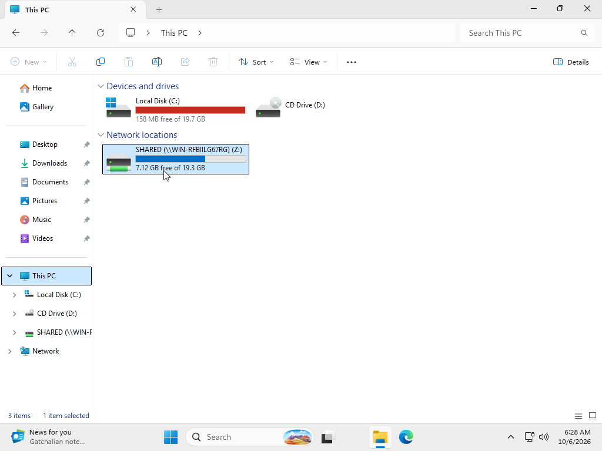
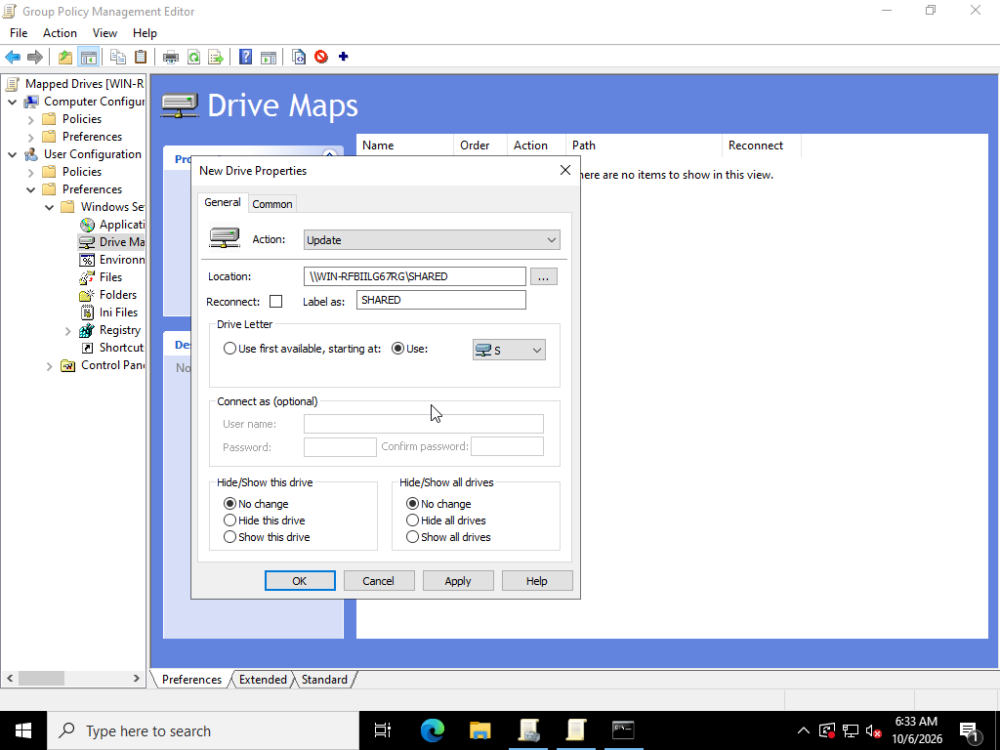
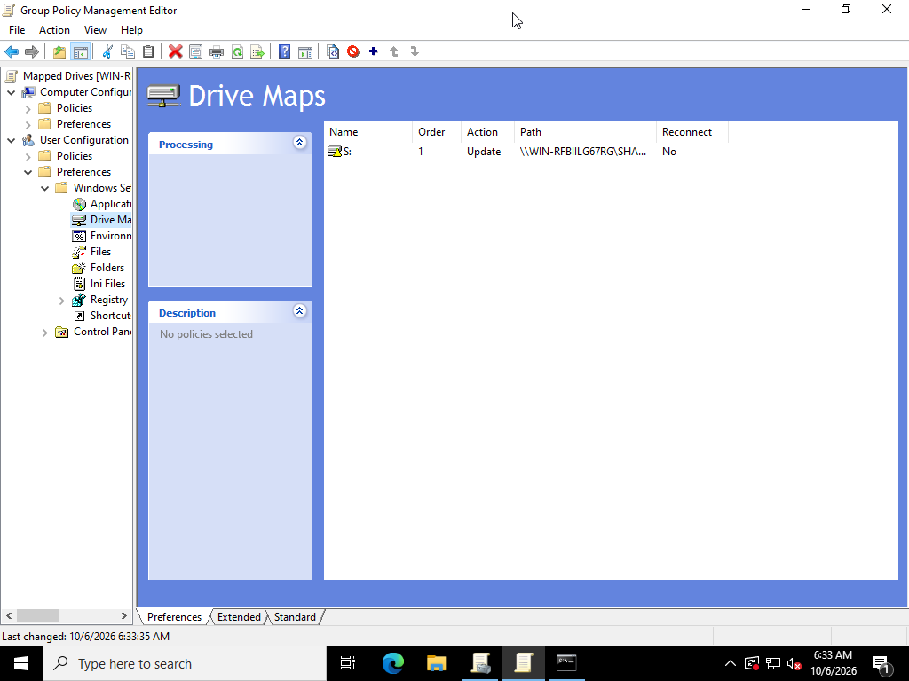
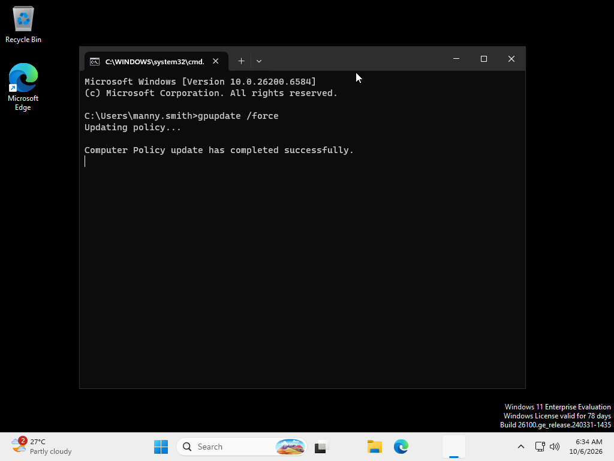
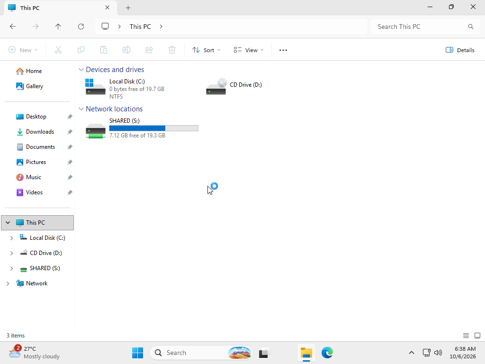
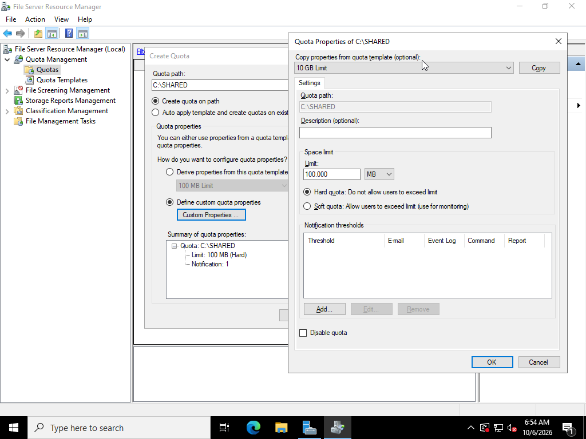
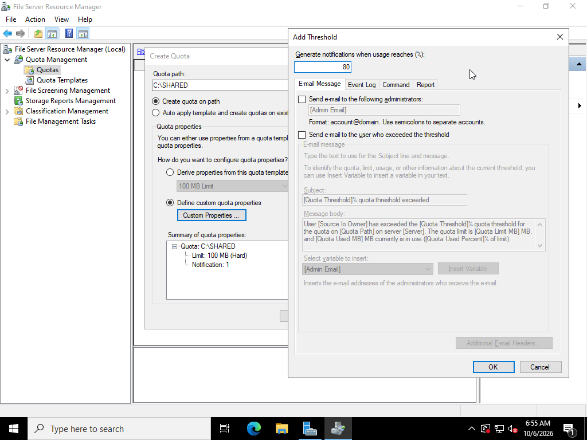
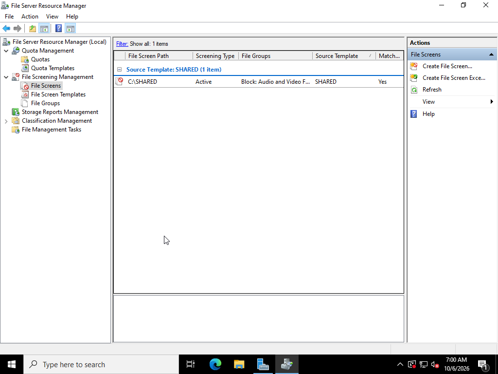

## Network Sharing

**Method 1: Manual Network Drive Mapping**

- Created a shared folder named SHARED on Windows Server and shared it with domain users.
  

- Mapped network drive (S:) on client laptop using the server's network share path
  

- Note: This method is for temporary access only. These mapped drives will be removed on clients after reboot/shutdown/restarts.

**Method 2: Network Sharing via Group Policy**

- Configured a GPO to automatically map the shared drive to domain users

- Used gpupdate /force command on client before confirming if shared folder is present

**File Server Resource Manager (FRSM):**

- Utilized FSRM for management of shared folder storage

**Storage Quota Management:**

- Configured a 10MB storage on SHARED folder
- Configured notification threshold triggered at 80% storage capacity

**File Screen Management:**

- Configured active file screening to restrict uploads and only allow .txt files to be saved in shared folder

