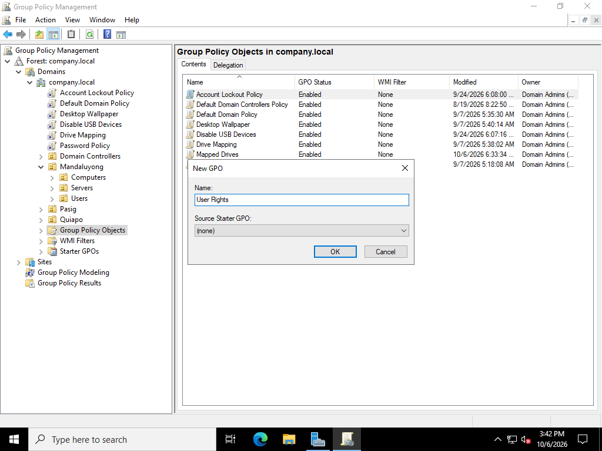
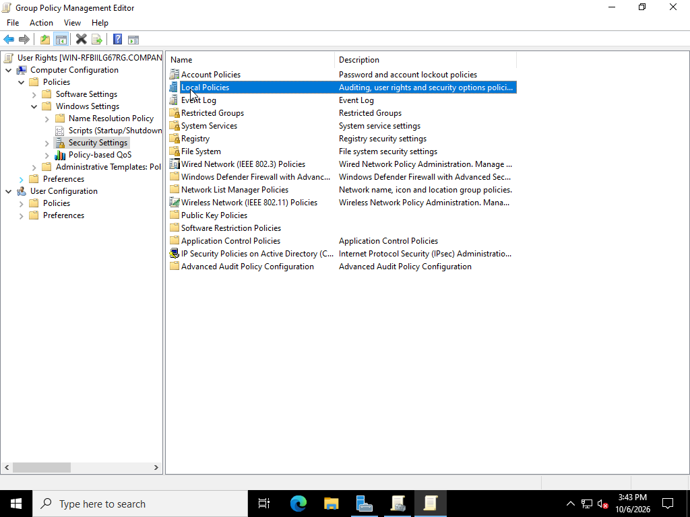
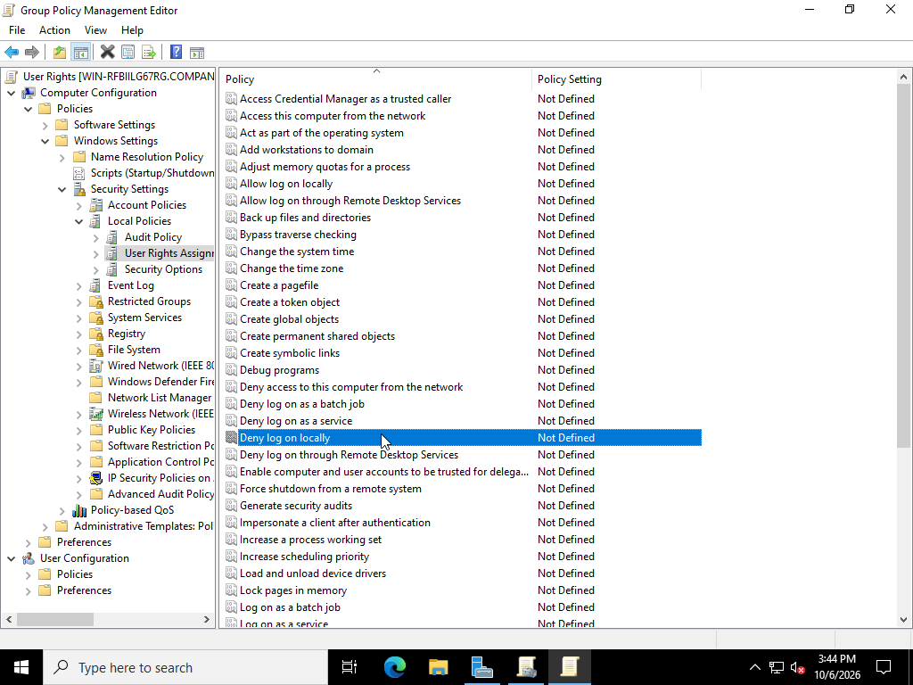
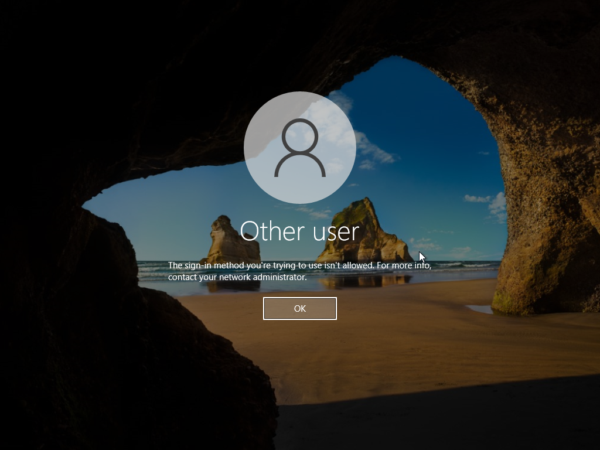

## User Rights Assignment

**User Rights:**

- Created a new GPO named "User Rights"
- Under Local Policies, the User Rights Assignment, allow Deny Logon Locally
- Allowed IT department remote log on through Remote Desktop Services

**Server Login**

- Logging in as a normal user account in server is porhibited
  
